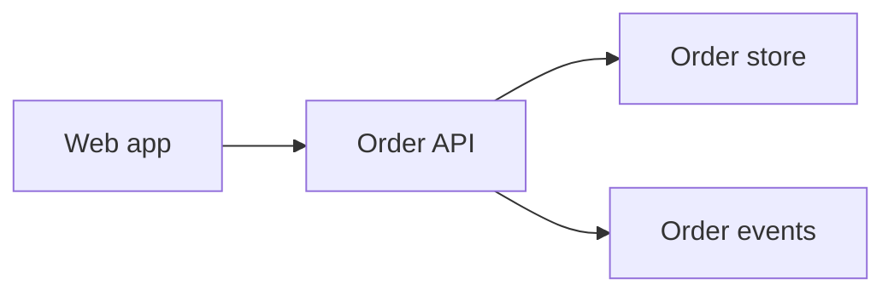
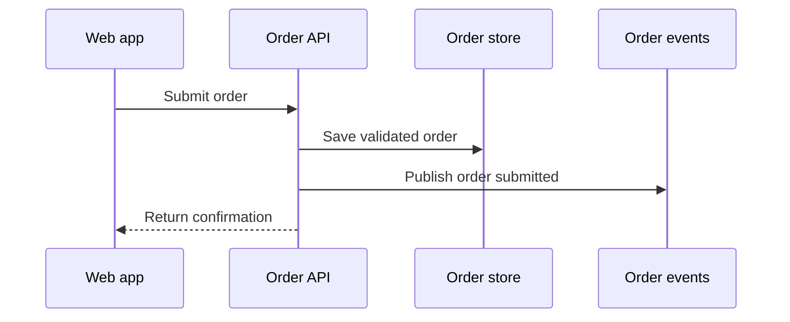
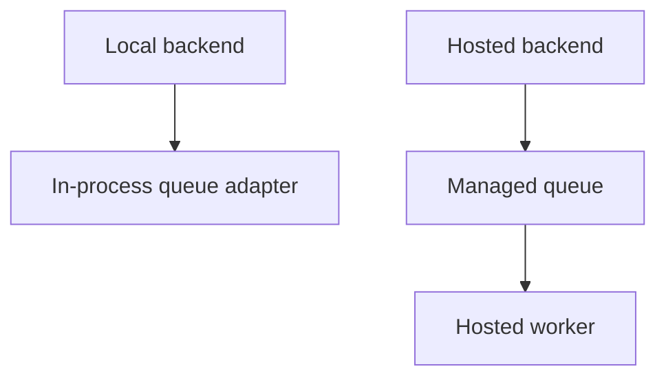
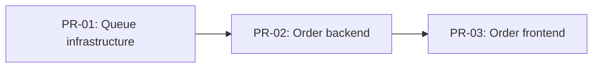

# Diagram policy fixture

## Input

Add order submission across web, order API, and a hosted queue. Local development uses
an in-process queue adapter. The backend validates, stores, and publishes each order.
Split delivery into backend, frontend, and infrastructure PRs. Also add an optional
`customerNote` field without changing its behavior or relationships.

## Expected architecture diagrams

Cross-domain flow in `architecture/order-submission-overview.md`, sourced by
`CONTRACT-submit-order` and `BEHAVIOR-order-confirmation`:

Backend interaction in `architecture/order-submission-backend.md`, sourced by
`CONTRACT-submit-order`:

Topology in `architecture/order-submission-infrastructure.md`, sourced by
`BEHAVIOR-order-event-runtime`:

## Expected PR dependency DAG

Embed in the readable order-submission sequence artifact before sequence approval:

## Explicit no-diagram case

`MODEL-customer-note` adds one optional field with no new lifecycle, interaction,
boundary, or topology. It requires no diagram because a diagram would duplicate prose.
No ADR diagram is needed because no hard-to-explain decision exists.
