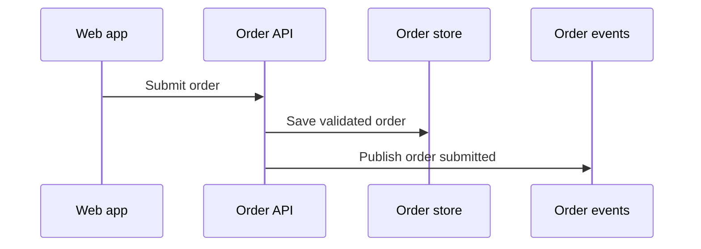

# Published review surface

## Input

Add hosted order submission across web, order API, and a queue. Reviewers should not
need the gitignored run folder.

## Expected published pack

```text
docs/features/hosted-order-events/
├── README.md
├── technical-spec.md
├── architecture-overview.md
├── sequence.md
└── prs/
    ├── 01-infrastructure-order-queue.md
    ├── 02-backend-publish-order-events.md
    └── 03-frontend-submit-order.md
```

`.lore-flow/runs/<run-id>/` may contain discovery, packets, reviews, and versions.
Those files are evidence, not the review surface.

## Expected architecture-overview facets

`architecture-overview.md` shows the end state, a simple `Order` model, the
`Submit order` contract, and a context diagram. Headings exist for those facets.

`prs/02-backend-publish-order-events.md` links to `#submit-order` and `#order-model`
and includes only this PR's nominal flow:



## Explicit exclusion

Do not publish packets, Ponytail transcripts, alias maps, or invalidation logs outside
`.lore-flow/`.
